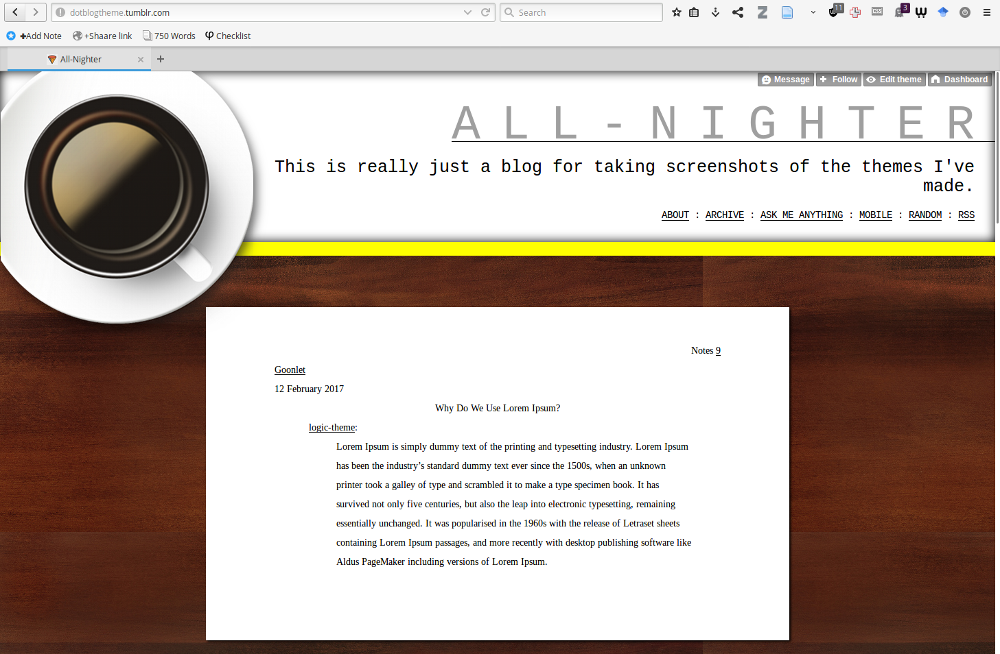
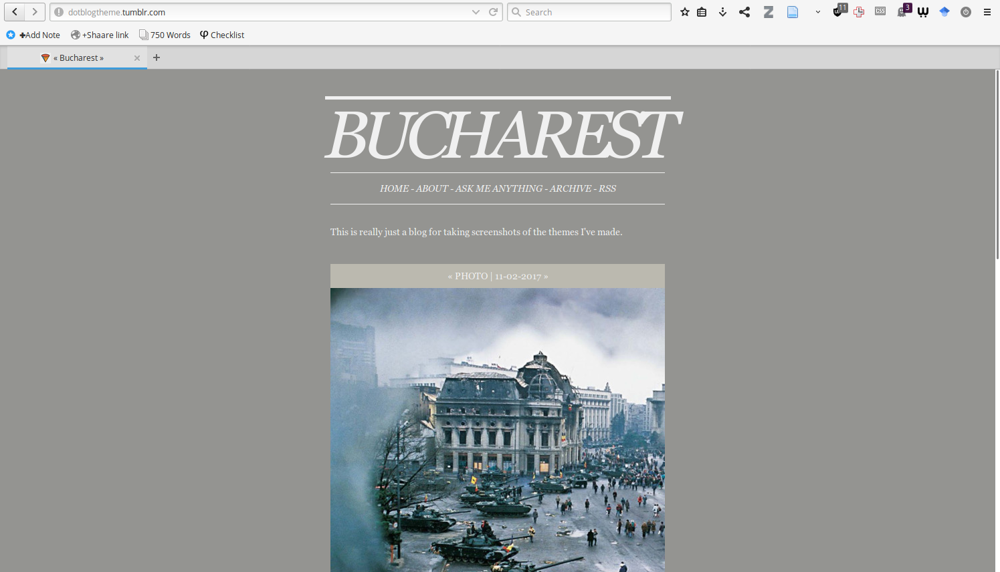
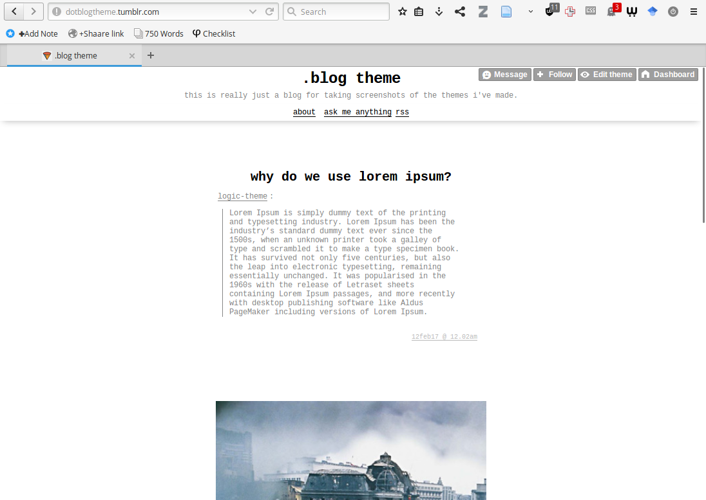
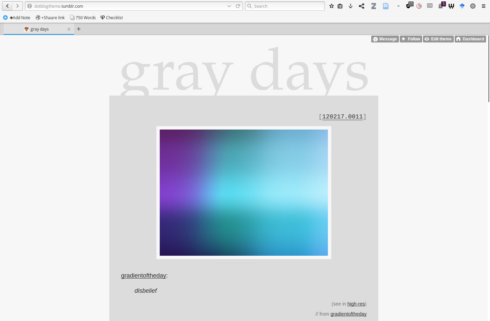
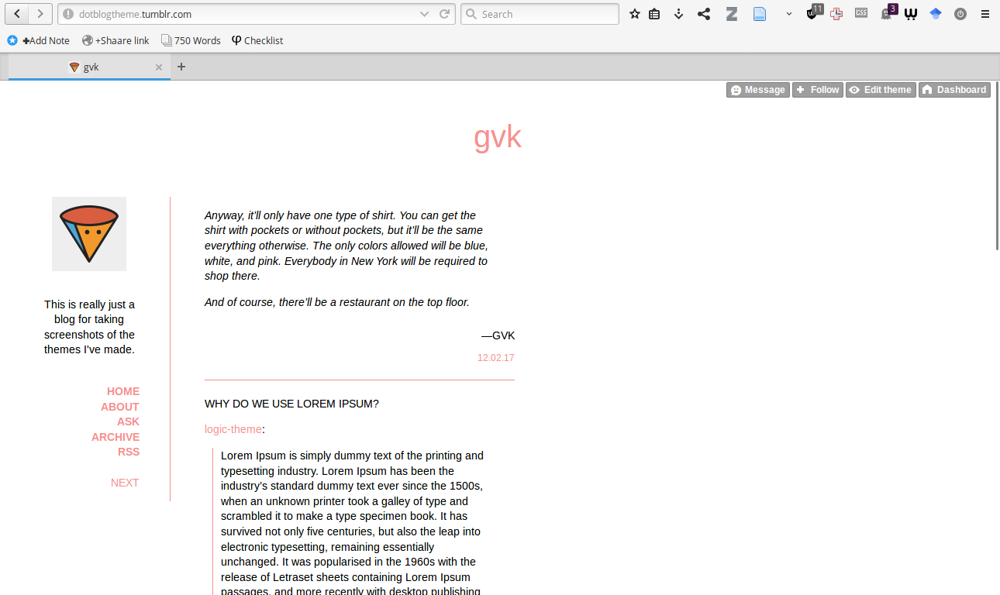
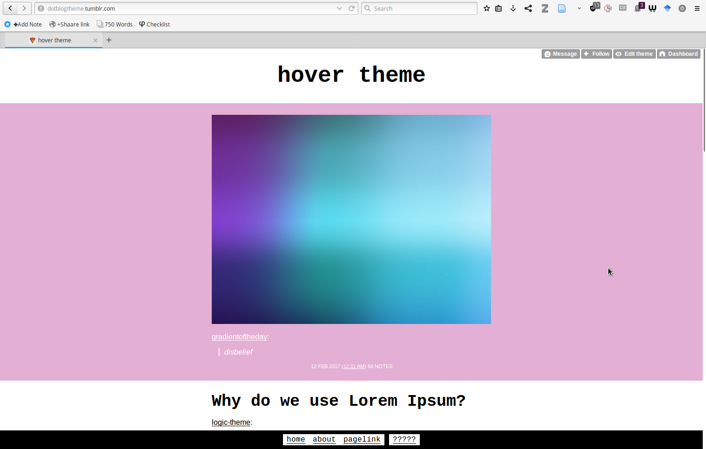
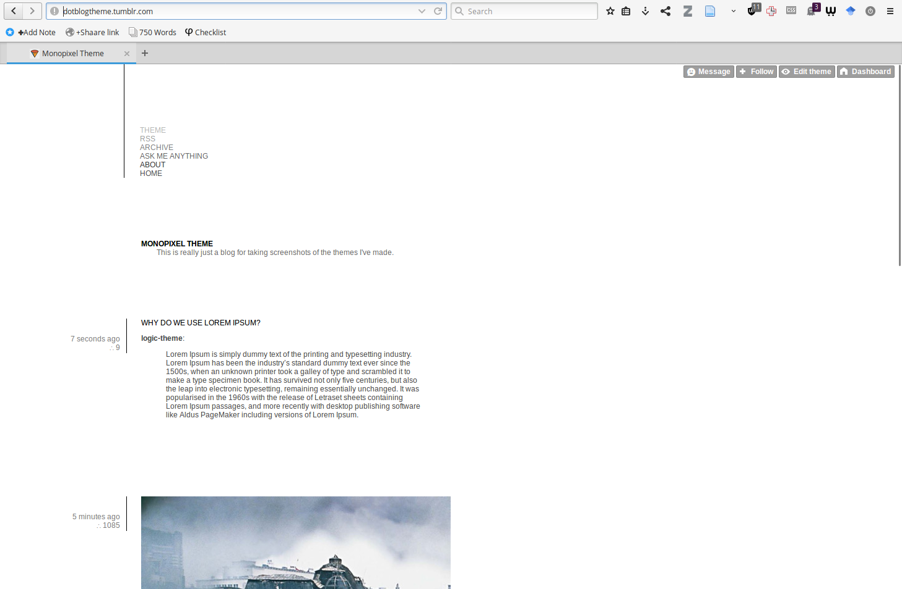
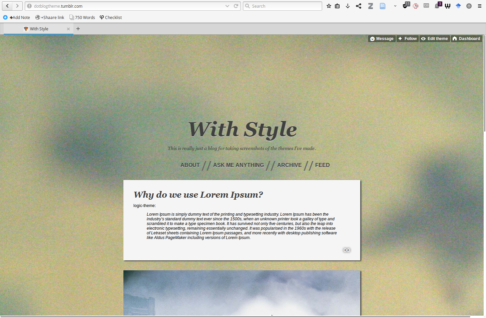

# Tumblr Themes

**Warning: A lot of these themes are quite buggy!** I made all of these between 2010 and 2014. As such, they do not reflect my current web design / front-end development abilities.

I also do not intend to develop these any further myself, but if you are so inclined, feel free to submit a pull request and I'll look it over.

## Installation

Unless Tumblr changes dramatically from here on out, here's how to do it as of February 2017:

1. Copy the entire text of the theme you want from the "code" folder in this repo
2. Visit https://www.tumblr.com/customize/{yourblogurlname}
3. Click on "Edit HTML"
4. Select all, then replace with the code you copied.

Some themes can also be installed from the Tumblr's official theme repository, as noted below.

## Details

### ALL-NIGHTER

Meant to format your posts in MLA style. Extreme (bad) skeuomorphism. I remember making this intentionally ugly. [Also available on Tumblr's official theme repository.](https://www.tumblr.com/theme/9998)

### Bucharest

Drab colors/background can be changed. Chat posts don't render very well in this one. [Also available on Tumblr's official theme repository.](https://www.tumblr.com/theme/32806)

### .blog theme

### gray days

Chronologically first. [Also available on Tumblr's official theme repository.](https://www.tumblr.com/theme/9564)

### gvk

Tumblr's theme repository rejected this one because it didn't meet their "aesthetic standards." I still can't see what was so bad about it.

### Hover Theme

Most customizable of these themes; you can even pick a tag whose posts you want to hide from the output. Features (and in fact relies on) infinite scroll.

### Monopixel

### With Style

Background can be changed, among other things. Can be made less skeuomorphic. [Also available on Tumblr's official theme repository.](https://www.tumblr.com/theme/30634)

## "If these are so old/awful, why post them (now)?"

Good question!

* I am 90% sure I won't be pursuing a career in web design, so I feel confident that these won't be held against me.
* A lot of these themes were only "bad" because they couldn't handle mobile very well. Tumblr recently (ok, a couple years ago) introduced special mobile-only theming, which fixes this issue.
* It's been a while since I've had the time/energy to make things for fun and this is me getting back into it.
